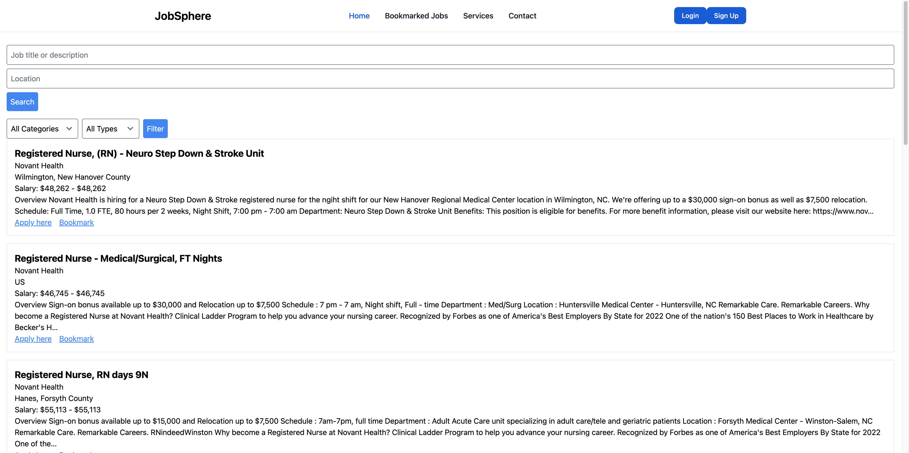
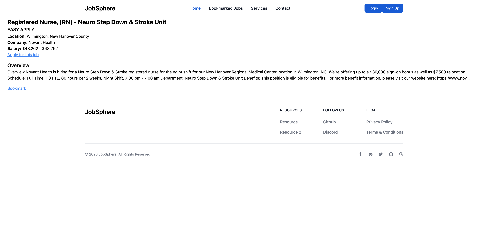
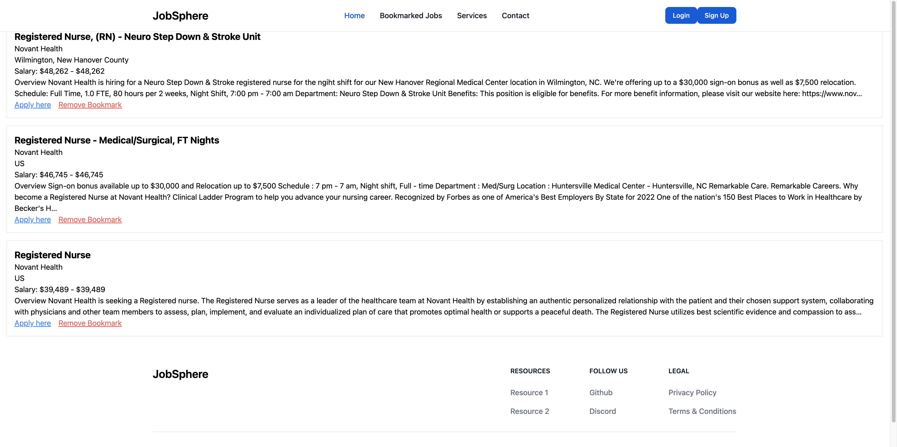
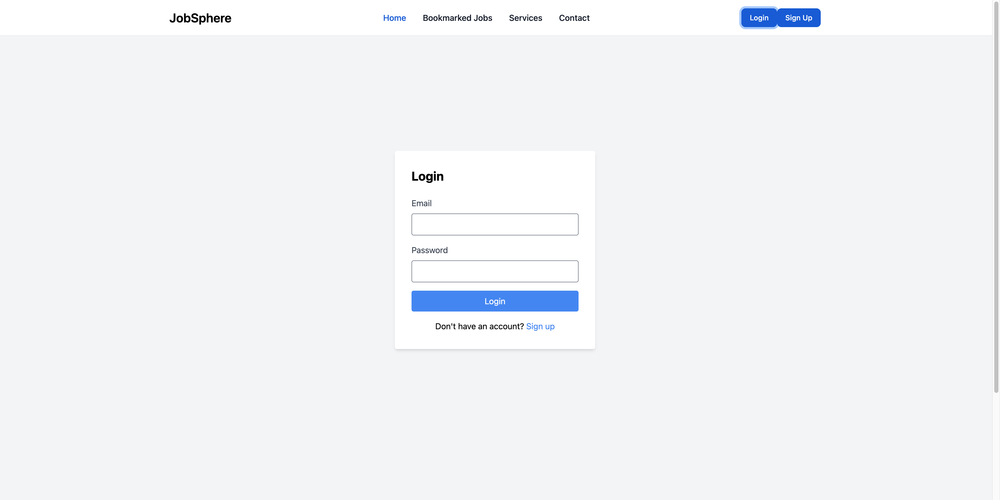
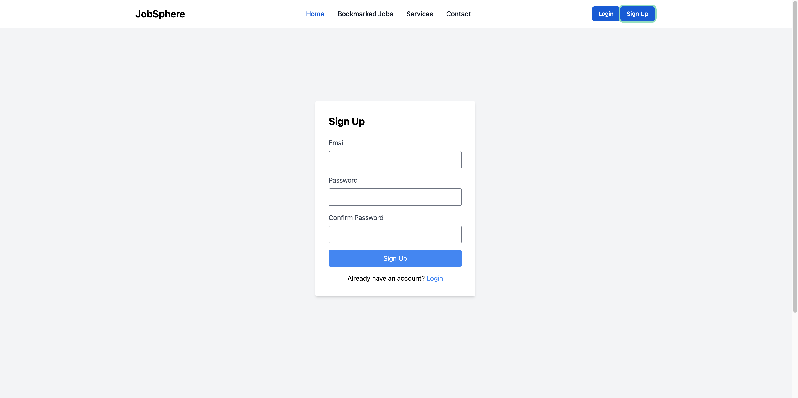

# JobSphere

## Description

Welcome to the JobSphere, a frontend project built using react and the AdZuna API. This project provides a platform for users to search for job listings.

## Table of Contents

- [Features](#features)
- [Technologies](#technologies)
- [Usage](#usage)

Home:

JobDetail:

Bookmarks:

Login:

Signup:

## Features

- Search for job listenings using the AdZune API
- View detailed job descriptions
- Bookmark job listings
- Responsive design for various devices

## Technologies

- Frontend: Vite-React
- Tailwind CSS
- Flowbite
- [AdZunaAPI](https://developer.adzuna.com/)

## Usage

- To see the app please follow the following link:
  [AppDemo](https://wonderful-halva-b271be.netlify.app/)

## Contact

Gilbert Espinoza

- Website - https://gilbertespinoza.dev/
- Email - Gilbertepsinoza9922@gmail.com
- Linkedin - www.linkedin.com/in/gilbertoespinoza1
